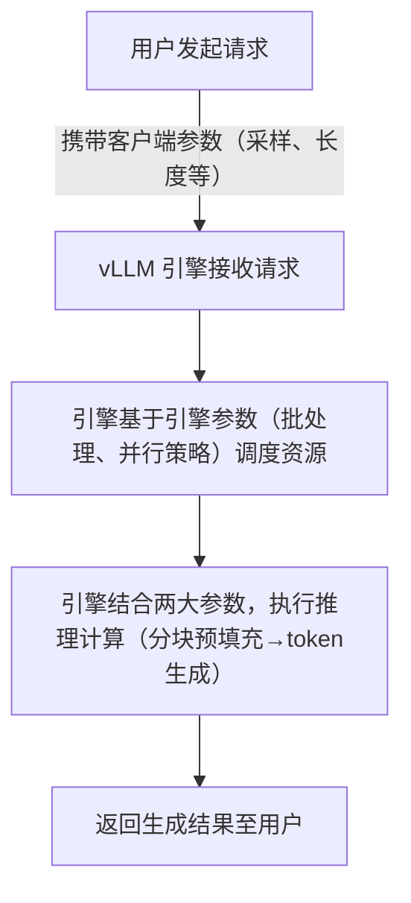

# 第五章 vLLM 推理参数精讲
## 本章目标:

-  掌握采样参数
-  了解引擎参数
- 掌握这两种参数的不同点，以及作用的区别
- 掌握如何传递采样参数

## 作业：

- 加载Qenwn3-4B模型
- 加入--max-sen-nums引擎参数
- 通过crul加入top_k采样参数，并把结果保存在/data/result/curl.txt目录下
- 通过OpenWeb UI输入不同的采样参数。观察模型输出结果的差异

vLLM 的推理参数是控制模型输出质量、性能效率的核心抓手，多数使用者易混淆“采样参数”的归属，实则推理参数可清晰划分为客户端参数与服务端/引擎参数两大阵营——前者决定“怎么生成”，后者决定“生成得有多快、多稳”。本章将从参数全景认知、分阵营详解、协同调优到实战应用，系统化拆解推理参数的使用逻辑与最佳实践，帮助使用者精准掌控模型输出与性能。

# 5.1 推理参数全景图：谁控制着模型的输出？

vLLM 的推理参数并非孤立存在，而是基于“请求发起-引擎调度-结果生成”的流程，分为两大核心阵营，二者协同工作，既保障输出符合需求，又最大化利用硬件资源。

## 5.1.1 推理参数的两大阵营

明确区分客户端参数与服务端/引擎参数，是掌握 vLLM 推理调优的基础，二者的核心差异的如下表所示：

|参数类型|作用域|核心目标|典型参数示例|
|---|---|---|---|
|客户端参数|单次请求|控制生成文本的随机性、多样性和停止条件|temperature, top_p, max_tokens, repetition_penalty|
|引擎参数|服务实例|优化GPU资源利用、调度策略和并行计算|max_num_batched_tokens, tensor_parallel_size, gpu_memory_utilization|
核心结论：客户端参数聚焦“生成质量”，针对单次请求的输出效果进行精准调控；引擎参数聚焦“运行性能”，针对整个服务实例的资源调度、并行效率进行全局优化，二者相辅相成，缺一不可。

## 5.1.2 客户端与引擎的协作流程

用户请求从发起至获取结果，客户端参数与引擎参数的协作流程清晰，核心分为4个步骤，流程图如下：

流程说明：用户发起请求时，需携带客户端参数（如 temperature、max_tokens），明确本次生成的需求；引擎接收请求后，根据自身配置的引擎参数（如 max_num_batched_tokens、tensor_parallel_size），分配GPU资源、调整批处理策略，将客户端参数融入推理计算流程；最终通过分块预填充、连续批处理等优化，生成符合预期的结果，同时保障推理速度与稳定性。

# 5.2 客户端参数详解：如何精准操控文本生成（实验就采用open-webui来控制）

客户端参数直接作用于单次文本生成过程，核心目标是让模型输出符合场景需求——无论是严谨的代码生成、富有创意的文案写作，还是结构化的分析报告，都可通过调整客户端参数实现。本节将按功能分类，详解核心参数的原理、用法及调优技巧。

## 5.2.1 随机性与多样性控制：temperature、top_p、top_k、min_p

这类参数的核心作用是调控模型生成token时的概率分布，决定输出的随机性与多样性，是最常用的客户端参数，需理解各参数的原理及组合使用逻辑。

### 核心参数原理

- temperature（温度）：控制概率分布的“平滑度”，取值范围 [0, ∞)，默认值 0.7。
        

    - temperature = 0：生成结果完全确定，模型仅选择概率最高的token，适合需要精准输出的场景（如代码生成、事实问答）；

    - temperature > 0：温度越高，概率分布越平滑，模型选择低概率token的可能性越大，输出多样性越强，但易出现逻辑混乱；

    - temperature > 1.5：随机性过高，输出内容易偏离主题、语法错误增多，一般不推荐使用。

- top_p（核采样）：又称“nucleus sampling”，取值范围 [0, 1]，默认值 1.0。核心是仅保留概率之和达到 top_p 的token，构成候选集，再从候选集中采样。
        

    - top_p = 1.0：保留所有token，等同于不启用核采样，此时 temperature 起主导作用；

    - top_p < 1.0：筛选核心候选token，减少低概率token的干扰，兼顾多样性与逻辑性，适合多数场景（如聊天、创意写作）。

- top_k（_top_k采样）：取值范围 [0, ∞)，默认值 -1（不启用）。核心是仅保留概率最高的 top_k 个token，构成候选集。

    - top_k = 0：不启用，等同于不限制候选集；

    - top_k > 0：限制候选集大小，减少计算量，同时避免模型选择极低概率的token，适合对速度有一定要求的场景。

- min_p（最小概率阈值）：取值范围 [0, 1]，默认值 0.0。核心是过滤掉概率低于 min_p 的token，即使其在 top_p 或 top_k 候选集中，进一步提升输出的逻辑性。
        

    - min_p = 0.0：不过滤，等同于不启用；

    - min_p > 0.0：适合需要严谨输出的场景（如法律文书、技术文档），避免模型生成无意义的低概率token。

### 组合使用技巧

vLLM 支持同时启用多个随机性参数，核心原则是：temperature 调控整体随机性，top_p/top_k/min_p 过滤候选集，避免参数冲突（如 top_p 与 top_k 同时启用时，取两者的交集作为候选集）。推荐组合如下：

- 精准场景（代码、事实问答）：temperature = 0.1~0.3 + top_p = 0.9 + min_p = 0.05，兼顾精准度与少量多样性；

- 平衡场景（聊天、通用文本）：temperature = 0.7 + top_p = 0.95，默认组合，适配多数需求；

- 创意场景（文案、故事写作）：temperature = 0.9~1.2 + top_p = 0.9 + top_k = 50，提升多样性，激发创意。

### 调优案例：不同 temperature 对生成效果的影响

以“代码生成”与“创意写作”两个场景为例，对比不同 temperature 值的输出差异，实验模型：Llama-3-8B-Instruct。

|场景|temperature 值|输出效果|评价|
|---|---|---|---|
|代码生成（需求：写一个Python字典排序函数）|0.2|def sort_dict(d):    return dict(sorted(d.items(), key=lambda x: x[1]))# 注释：按值升序排序，逻辑清晰，无冗余代码|✅ 最优，精准满足需求，代码可直接运行|
||0.7|def sort_dict(d, reverse=False):    sorted_items = sorted(d.items(), key=lambda x: x[1], reverse=reverse)    return dict(sorted_items)# 注释：增加了reverse参数，功能更完善，但超出基础需求|✅ 良好，功能冗余但逻辑正确|
||1.3|def sort_dict(d):    keys = list(d.keys())    values = list(d.values())    sorted_values = sorted(values)    return {keys[values.index(v)] for v in sorted_values}# 注释：逻辑繁琐，存在bug（重复值会导致键匹配错误）|❌ 较差，随机性过高，代码无法正常使用|
|创意写作（需求：写一句描写春天的文案）|0.2|春天来了，花儿开了，小草绿了，到处都是生机勃勃的景象。|✅ 通顺，但过于平淡，缺乏创意|
||0.7|风携着暖意漫过枝头，花苞破茧而出，青草顶开泥土，把春天的温柔铺满人间。|✅ 最优，语句优美，兼具流畅性与创意|
||1.3|春的指尖拂过云端，花瓣乘着风的翅膀，在时光里织就一场彩色的梦，泥土里藏着星星的呼吸。|⚠️ 创意十足，但语句略显晦涩，逻辑性减弱|
案例结论：temperature 的取值需贴合场景需求——精准场景取低值（0.1~0.3），创意场景取中高值（0.7~1.2），过高（>1.3）或过低（<0.1）都会影响输出质量。

## 5.2.2 重复抑制与词汇控制：repetition_penalty、frequency_penalty、presence_penalty

大模型推理时易出现“重复生成”问题（如重复短语、循环语句），这类参数的核心作用是抑制重复，同时可针对性控制词汇的出现频率，三者原理不同，适用场景也有所差异，需精准区分。

### 核心参数异同点解析

|参数名称|核心原理|作用效果|推荐值范围|
|---|---|---|---|
|repetition_penalty（重复惩罚）|对已生成的token，按重复次数递增惩罚其概率，重复次数越多，惩罚越强|抑制整体重复，适合解决长文本生成中的循环重复问题|1.0~1.5（1.0=无惩罚，1.2为常用值）|
|frequency_penalty（频率惩罚）|按token在生成文本中的出现频率，降低其概率，频率越高，惩罚越强|抑制高频词汇的过度使用，不影响低频重复|0.0~0.5（0.2~0.3为常用值）|
|presence_penalty（存在惩罚）|只要token已出现过（无论频率），就降低其概率，仅影响“是否出现”，不影响出现次数|鼓励生成新词汇，减少重复词汇的出现，适合创意写作|0.0~0.5（0.1~0.2为常用值）|
### 使用建议

- 解决长文本重复（如论文、报告）：repetition_penalty = 1.2 + frequency_penalty = 0.2，兼顾抑制重复与词汇多样性；

- 创意写作（如文案、故事）：presence_penalty = 0.15 + repetition_penalty = 1.1，鼓励新词汇，轻微抑制重复；

- 短文本（如聊天、问答）：无需启用，或仅设置 repetition_penalty = 1.1，避免过度惩罚导致语句不流畅；

- 注意：惩罚值过高（如 repetition_penalty > 1.5）会导致模型生成碎片化文本，逻辑断裂，需谨慎调整。

## 5.2.3 输出长度与停止策略：max_tokens、min_tokens、stop

这类参数的核心作用是控制生成文本的长度范围，以及终止生成的条件，避免输出过长、过短，或未完成核心内容就停止生成，是保障输出完整性的关键。

### 核心参数详解

- max_tokens（最大生成token数）：
        

    - 取值范围 [1, max_model_len - prompt_tokens]，默认值 16，核心是限制单次生成的最大token数量，避免OOM或无意义的长文本；

    - 最佳实践：根据场景设置，聊天场景设为 100~500，代码/报告场景设为 500~2000，同时需小于模型的 max_model_len（避免超出上下文窗口）。

- min_tokens（最小生成token数）：
        

    - 取值范围 [1, max_tokens]，默认值 1，核心是确保生成文本达到最小长度，避免因提前触发停止条件导致内容不完整；

    - 最佳实践：仅在需要固定长度输出（如短文案、摘要）时设置，一般场景无需刻意设置（保持默认1即可）。

- stop（停止条件）：
        

    - 支持字符串列表（如 ["\n", "###"]）或 Token ID 列表，核心是当模型生成指定内容时，立即终止生成；

    - 优先级：stop 参数 > max_tokens > 模型内置停止token（如 </s>）；

    - 最佳实践：结合prompt格式设置，如使用指令微调模型时，设置 stop=["### 结束"]，确保模型在完成指令后停止生成。

### 常见问题与解决方案

- 问题1：生成内容未完成就停止 → 检查 max_tokens 是否过小，或 stop 参数是否误触发，可增大 max_tokens、调整 stop 列表；

- 问题2：生成内容过长，冗余严重 → 降低 max_tokens，启用 repetition_penalty，同时优化 prompt 指令（明确输出长度要求）；

- 问题3：min_tokens 生效但内容冗余 → 降低 min_tokens，同时通过 prompt 引导模型聚焦核心内容，避免凑数式生成。
